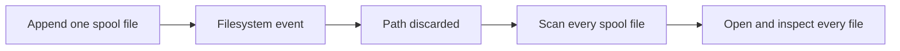
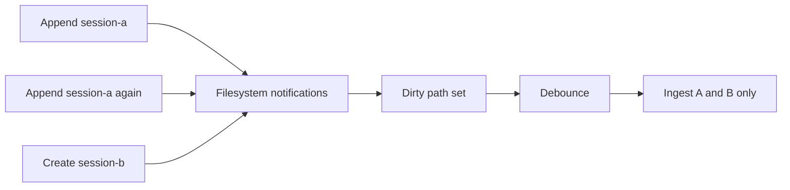

# Action plan: resident I/O and evidence-driven spool lifecycle

- **Status:** initial implementation complete; broader usage evidence pending
- **Current implementation scope:** agentic-footprint only
- **Explicitly out of scope:** CodeCarbon Rust integration and Parquet archive
  implementation
- **Principle:** measure real usage before selecting a spool lifecycle or
  archive format

This is the active plan derived from the architecture and performance review.
The CodeCarbon boundary evidence is kept separately in
[`evidence-codecarbon-rust-boundary.md`](evidence-codecarbon-rust-boundary.md).
The consolidated project status and post-plan priorities are recorded in
[`checkpoint-2026-07-26.md`](checkpoint-2026-07-26.md).

## Implementation result — 2026-07-26

The first evidence/dirty-path batch is implemented:

- `notify` paths are retained and deduplicated through debounce;
- ordinary appends tail only matching changed spool files;
- the two-second resident tick performs sampler supervision without spool or
  SQLite-offset I/O;
- a 30-second full-directory reconciliation remains the missed-event fallback;
- watcher errors and failed ingest passes force the next reconciliation;
- empty event batches do not open SQLite transactions;
- unchanged offsets are not written;
- debug health reuses cached file/offset state rather than rescanning;
- scan, tail, validation, insertion, offset, byte, line, and total costs are
  available in internal debug diagnostics and deterministic ignored tests.

Machine-local debug-build evidence from the deterministic fixtures:

| Historical files | Events/file | Full-scan append | Targeted append | File opens / offset reads |
|---:|---:|---:|---:|---:|
| 1 | 100 | 0.387 ms | 0.452 ms | 1 → 1 |
| 100 | 100 | 2.732 ms | 0.215 ms | 100 → 1 |
| 1,000 | 10 | 28.184 ms | 0.171 ms | 1,000 → 1 |

The unchanged 1,000-file full scan cost 26.791 ms despite reading zero event
bytes; the new two-second supervision tick does not run ingestion at all. The
30-second reconciliation intentionally retains that full-scan cost as the
correctness backstop.

These figures establish scaling direction, not production latency budgets.
They were collected once on the development machine with warm caches and an
unoptimized Rust build. Batch 3 still needs repeated release-build runs,
p95/p99, cold-cache experiments where practical, realistic day-scale traces,
and append-to-raw/join latency before any lifecycle or archive decision.

## 1. Current baseline

The completed optimization batches already provide:

- touched-session rebuilds during normal watch passes;
- full-store rebuild only for initial or changed zone context;
- one SQLite connection through ingest and rebuild;
- one load of each touched session per pass;
- real SQLite indexes;
- bounded resident debug/dedup structures;
- cached Python health checks;
- substantially fewer hook subprocesses.

The main remaining resident-loop issue that can be addressed independently is
avoidable spool discovery and no-op database work.

## 2. Dirty-path spool ingestion

"Dirty" means **possibly changed since the previous ingest**. It does not mean
invalid, corrupted, or rejected.

### Current behavior

The filesystem watcher receives detailed events, but the watch loop keeps only
`()`—"something in the directory changed." After debounce, ingestion scans
every spool file and asks SQLite for every file's offset to discover which file
actually changed.



### Proposed behavior

Retain the paths supplied by the filesystem watcher and deduplicate them during
the debounce window.



A burst of 100 notifications for one file becomes one path in the set and one
tail operation.

Suggested state:

```rust
struct DirtySpool {
    paths: BTreeSet<PathBuf>,
    full_rescan_required: bool,
    last_reconciliation: Instant,
}
```

### Correctness fallback

Filesystem notifications are hints, not the source of truth. The design keeps
a periodic full reconciliation:

- watcher error or queue overflow sets `full_rescan_required`;
- ambiguous rename/remove events may force a full rescan;
- a slower periodic sweep catches notifications missed by the OS/backend;
- stored byte offsets and event IDs remain the idempotency mechanism;
- a trailing partial line remains unconsumed until its newline arrives.

The optimization changes the common path from "all spool files" to "recently
changed spool files" without making correctness depend exclusively on notify.

## 3. Remove no-op database and file work

Targeted ingestion should also avoid writes that cannot change state:

- do not start an `insert_events` transaction for an empty event list;
- do not upsert an offset when the byte offset is unchanged;
- obtain file metadata before allocating a tail buffer;
- batch inserts and offset changes for one ingest cycle where transaction
  boundaries preserve crash recovery;
- retain a prepared or cached offset lookup path if profiling shows it matters.

The important crash invariant remains:

> An offset must never advance beyond bytes whose complete events were durably
> inserted or deliberately quarantined.

## 4. Measure before designing spool lifecycle

JSONL rotation, compaction, deletion, SQLite retention, and Parquet are not in
the current implementation scope. The next step is to confront the existing
design with realistic usage and collect numbers.

### Questions to answer

1. How many spool files exist after an hour, a day, and a week of use?
2. How quickly do individual files grow by collector and event type?
3. How many bytes are appended per tool call, LLM call, and energy interval?
4. How much time does an idle reconciliation spend in directory scan,
   metadata, open, read, validation, SQLite lookup, and SQLite write?
5. How does ingest latency scale with file count and total historical bytes?
6. What percentage of periodic passes find no new complete line?
7. How much storage is duplicated between JSONL and SQLite?
8. How compressible are representative raw files?
9. How often are raw JSONL files manually inspected or used for recovery?
10. What replay/import access patterns would an archive actually need?

### Workloads to capture

- short single-session coding task;
- full working-day session;
- several concurrent sessions;
- high-frequency OTLP export;
- sidecars at 1 s, 5 s, and longer energy intervals;
- malformed and trailing-partial records;
- restart with an existing large spool;
- seven-day synthetic retention;
- realistic ML or framework collector traffic when available.

### Metrics

At minimum collect:

```text
spool_files_total
spool_bytes_total
spool_bytes_by_collector
dirty_paths_per_wake
full_rescan_files
tail_files_opened
tail_bytes_read
complete_lines_read
partial_lines_seen
events_inserted
events_deduplicated
offset_reads
offset_writes
empty_insert_batches
ingest_duration_ms
reconciliation_duration_ms
append_to_raw_event_latency_ms
append_to_join_latency_ms
```

These should initially be test/benchmark counters or debug diagnostics, not a
new permanent public telemetry contract.

## 5. Benchmark matrix

Create deterministic fixtures with:

| Files | Events/file | Appended files/pass | Purpose |
|---:|---:|---:|---|
| 1 | 100 | 1 | Small baseline |
| 100 | 100 | 1 | Historical-file penalty |
| 1,000 | 10 | 1 | Directory/open scaling |
| 100 | 10,000 | 1 | Large-file tail behavior |
| 100 | 100 | 100 | Burst ingest throughput |

For each case compare:

- current full scan;
- dirty-path targeted ingest;
- forced reconciliation scan;
- warm and cold filesystem cache where the environment permits;
- unchanged files versus files with partial and complete appended lines.

Do not optimize only median latency. Record p95/p99, total bytes read, file
opens, and SQLite writes.

The deterministic warm-cache matrix is implemented as an ignored `af-cli`
unit test. Run it in release mode so debug-build overhead does not dominate:

```sh
cargo test --release -p af-cli ingest_benchmark_matrix_evidence \
  -- --ignored --nocapture
```

It defaults to 100 append samples per case and reports p50/p95/p99 together
with total file opens, bytes read, offset reads/writes, and inserted events for
both full-scan and targeted ingestion. Set `AF_INGEST_BENCH_SAMPLES` only for
quick harness checks; fewer than 100 samples are not sufficient p99 evidence.
The harness alternates which mode runs first to reduce systematic warm-cache
bias, but it does not claim cold-cache results.

### Warm-cache release evidence — 2026-07-26

One development-machine run used the default 100 samples per case. These are
scaling observations, not portable latency budgets:

| Case | Mode | p50 ms | p95 ms | p99 ms | File opens | Offset reads |
|---|---|---:|---:|---:|---:|---:|
| 1 × 100, append 1 | Full scan | 0.214 | 0.542 | 1.165 | 100 | 100 |
| 1 × 100, append 1 | Targeted | 0.196 | 0.557 | 1.046 | 100 | 100 |
| 100 × 100, append 1 | Full scan | 5.407 | 15.835 | 20.510 | 10,000 | 10,000 |
| 100 × 100, append 1 | Targeted | 0.292 | 2.104 | 3.442 | 100 | 100 |
| 1,000 × 10, append 1 | Full scan | 24.867 | 28.268 | 39.070 | 100,000 | 100,000 |
| 1,000 × 10, append 1 | Targeted | 0.136 | 0.211 | 0.256 | 100 | 100 |
| 100 × 10,000, append 1 | Full scan | 2.282 | 3.016 | 8.074 | 10,000 | 10,000 |
| 100 × 10,000, append 1 | Targeted | 0.118 | 0.166 | 0.532 | 100 | 100 |
| 100 × 100, append 100 | Full scan | 13.341 | 19.102 | 22.933 | 10,000 | 10,000 |
| 100 × 100, append 100 | Targeted | 11.974 | 15.949 | 19.932 | 10,000 | 10,000 |

The single-file append cases read the same appended bytes and perform the same
successful offset writes in both modes; the difference is historical file
opens and offset lookups. The 100-file burst intentionally converges because
all files are dirty. Cold-cache repetition, partial-line variants, forced
reconciliation, append-to-raw/join latency, and realistic traces remain open.

## 6. Evidence required before a lifecycle decision

A later spool-lifecycle RFC should be triggered by measured thresholds, for
example:

- reconciliation cost grows materially with historical file count;
- state-dir disk use becomes operationally significant;
- startup or replay exceeds an agreed latency budget;
- raw retention is needed for audit but not hot reporting;
- compression produces a meaningful storage reduction;
- analytical queries over history become a real workflow.

At that point, compare alternatives against the measured workload:

- retain JSONL indefinitely;
- rotate JSONL segments;
- compress closed JSONL;
- delete raw files after verified SQLite ingestion;
- export a cold archive such as Parquet;
- use an OTLP-native or external observability backend.

Parquet remains a candidate, not a decision. Its columnar advantages matter
only if the real archive workload performs bulk analytical scans and if row
counts are large enough to avoid a small-file problem. Exact raw-event
recovery, schema evolution, write amplification, dependency cost, and local
operational complexity must be measured in the comparison.

## 7. Initial implementation scope

### Batch 1 — observability for the ingest path

- add internal counters/timers for scan, tail, validation, insert, offset, and
  end-to-end ingest work;
- add fixture generation for file-count and file-size scaling;
- establish baseline benchmark results before behavioral optimization;
- keep instrumentation removable or behind test/debug surfaces.

### Batch 2 — dirty-path targeted ingestion

- carry relevant paths through the notify channel;
- deduplicate paths during debounce;
- introduce targeted spool parsing/ingestion APIs;
- skip empty insert transactions and unchanged offset writes;
- retain a configurable slower full reconciliation;
- test watcher errors, rename/create/write bursts, partial lines, truncation,
  and missed-event recovery.

### Batch 3 — before/after evidence

- rerun the benchmark matrix;
- capture idle I/O and append-to-ingest improvements;
- verify CPU, file-open, bytes-read, and SQLite-write reductions;
- exercise realistic day-scale traces;
- publish results and revise the lifecycle questions from observed data.

No spool rotation, deletion, compression, or Parquet implementation belongs in
these batches.

## 8. Remaining global plan

After this initial scope, separately review:

1. move remote-impact estimation to a bounded worker so watch ingestion does
   not wait on Python;
2. decide spool lifecycle only from the collected evidence;
3. replace the serialized OTLP request loop if concurrent real usage shows it
   is a bottleneck;
4. make electricity-zone context session/host scoped;
5. split generic OTLP transport from agent-specific normalizers;
6. decide how older control planes preserve unknown event kinds;
7. implement the recorded iteration-2 structural backlog: first-class
   bootstrap spans, exhaustive span classification, typed/versioned
   `ImpactJoin`, one ingest normalization stage, `SampleOutcome`,
   sub-quadratic apportionment, and schema-native estimator names.

The separate CodeCarbon evidence note remains an input to another project's
timeline, not a dependency or task in this active plan.

## 9. Review decisions needed

Before Batch 1:

1. Which benchmark workloads best approximate expected real usage?
2. What latency and idle-I/O budgets should define success?
3. Should counters be exposed only in benchmarks/tests, or also through the
   debug health endpoint?
4. How slow may the reconciliation fallback be—10 s, 30 s, 60 s, or adaptive?
5. Which platforms/filesystems must notify behavior be tested on?
