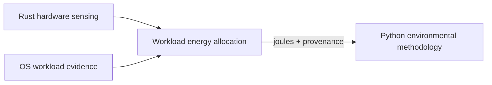

# Evidence note: Rust sensing and Python methodology boundary

- **Status:** evidence gathered for asynchronous review
- **Scope:** motivation and interface observations only
- **Out of scope for agentic-footprint today:** integrating or modifying
  `codecarbon-core`
- **Authoritative local worktree reviewed:** `../codecarbon-core`
- **Excluded:** the outdated `../carbon-sensor` worktree

This note records evidence discovered while reviewing agentic-footprint's
current one-CodeCarbon-sampler-per-session design. It is intentionally not an
implementation plan for either repository.

## Why this use case matters

agentic-footprint currently launches one Python CodeCarbon sampler for every
active agent session. Each sampler measures in machine mode. When sessions
overlap, multiple samplers can observe the same host energy independently.

This creates a useful design case for the CodeCarbon Rust rewrite:

- hardware energy is naturally host-scoped;
- workload ownership is defined by an external orchestrator;
- several concurrent workloads must share one measured interval;
- sensor access must not block the orchestrator's event loop;
- environmental methodology can run less frequently over larger batches;
- auditors need evidence and methodology provenance to remain distinguishable.

## Responsibility split suggested by the evidence

The observations support separating four concepts:



### Hardware sensing

Platform-specific access to RAPL, IOReport/SMC, NVML, AMD interfaces,
Windows counters, and modeled fallbacks. The sensor reports observations and
their provenance; it does not need to understand agent sessions, training
runs, tasks, or tools.

### Workload evidence

CPU/GPU time, process-tree, cgroup, container, memory, and I/O deltas. An
orchestrator maps these OS identities onto its own workload identities.

### Energy allocation

Combines one host measurement with concurrent workload evidence. The core
accounting invariant is:

```text
allocated + unattributed + background + orphaned = measured
```

Whether this allocation belongs inside `codecarbon-core`, in an optional Rust
crate, or in consuming orchestrators remains an open design decision.

### Environmental methodology

PUE, electricity mix, location/time factors, GHG, water, resources, embodied
impact, uncertainty, and project metadata. These are slower, data-oriented,
versioned operations suitable for Python and audit workflows.

## Evidence from the current local `codecarbon-core`

The local worktree already establishes useful properties:

- `Sensor::snapshot()` is a non-blocking cached read;
- a background worker owns provider and OS access;
- snapshots separate component power and energy deltas;
- provider status and warnings are explicit;
- provider identity travels with readings;
- Linux can optionally attach per-process attribution;
- Python bindings expose value snapshots rather than platform providers.

These properties support an orchestration use case, but an accounting consumer
has needs beyond a latest-value dashboard snapshot.

## Data an accounting-oriented consumer needs

The following is a requirements inventory, not a proposed committed API.

### Interval identity

- monotonic interval start and end;
- wall-clock interval start and end;
- sequence number;
- host identity;
- boot identity;
- sensor-instance identity.

Monotonic time defines duration and ordering. Wall time supports external
telemetry joins and location datasets. Restart identity prevents two separate
sensor lifetimes from appearing continuous.

### Machine evidence

- energy delta when a provider exposes an interval counter;
- average power when integration is required;
- component and device identity;
- provider and provider version;
- measured versus vendor-estimated versus host-modeled quality;
- structured model provenance for TDP or constant-power fallback;
- explicit unavailable, stale, reset, and missing-window states.

### Workload evidence

- PID plus process start time to survive PID reuse;
- process-tree, cgroup, container, or device-context identity;
- CPU and GPU time deltas;
- I/O deltas;
- memory byte-seconds where meaningful;
- liveness at interval end;
- host totals needed to interpret workload shares.

### Stream behavior

A latest snapshot is not sufficient for accounting if intermediate windows can
be overwritten before a consumer reads them. Useful semantics include:

- ordered retained observations;
- bounded buffering;
- cursors or sequence acknowledgements;
- explicit overflow gaps;
- no indefinite sensor blocking when a consumer is slow;
- deterministic counter-reset behavior.

The exact API—cursor, channel, callback, iterator, or a combination—is a
separate CodeCarbon design question.

## Evidence agentic-footprint can eventually provide

This project can provide realistic fixtures for the Rust core work without
making that work part of today's agentic-footprint scope:

- two or more overlapping agent sessions;
- one host measurement interval shared by those sessions;
- short-lived child processes;
- process trees that outlive their semantic span;
- unobserved background host activity;
- remote-only spans that must receive no local energy;
- missing process evidence requiring an explicit fallback;
- sampler restart and missing-window gaps;
- conservation assertions over every component and interval.

These are also relevant to ML workloads: concurrent jobs, notebooks, workers,
ranks, data loaders, and orphaned subprocesses.

## Questions for asynchronous CodeCarbon review

1. Is `codecarbon-core` intended to expose only hardware evidence, or also OS
   workload evidence?
2. Should provider-owned per-process attribution remain a convenience view
   while raw resource deltas become available separately?
3. Does the accounting interface need a retained observation stream in
   addition to `snapshot()`?
4. Which identities define continuity: host, boot, provider, sensor process,
   device, and sequence?
5. How should direct energy counters, sampled power, and modeled power expose
   their different quality and integration semantics?
6. Where should conservation-enforcing workload allocation live?
7. What is the smallest batch contract Python needs to apply CodeCarbon
   methodology without owning high-frequency hardware sampling?

## Shared timeline, not current scope

The likely dependency order across projects is:

1. gather real agentic-footprint traces and failure cases;
2. use them to review the Rust sensing/accounting contracts;
3. stabilize whichever evidence surface CodeCarbon chooses;
4. only then evaluate a future agentic-footprint migration away from its
   Python machine sampler.

No agentic-footprint integration should be scheduled until the Rust contract
and real measurements justify it.

