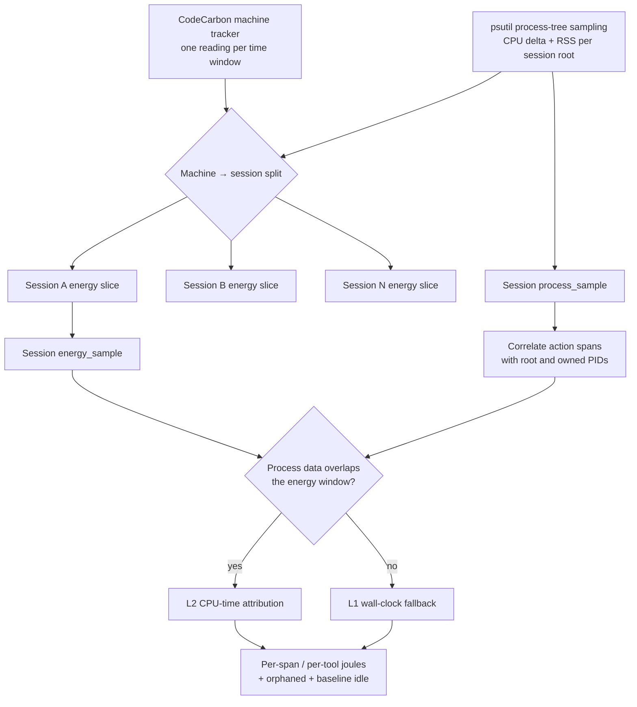
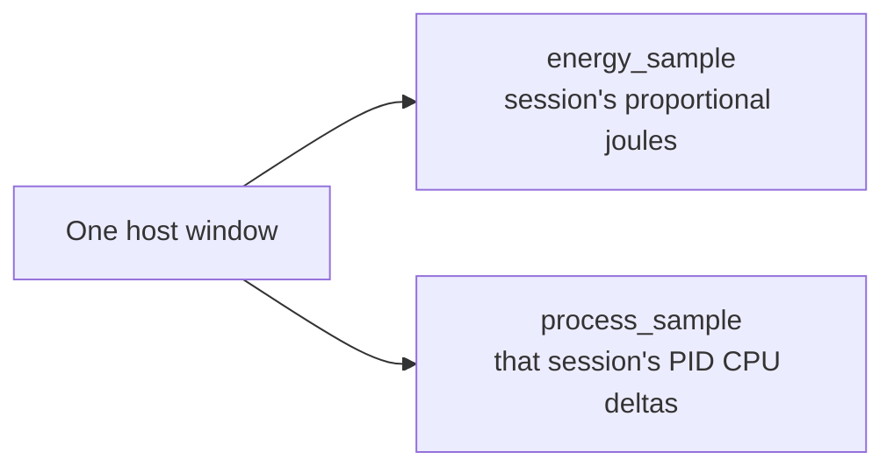
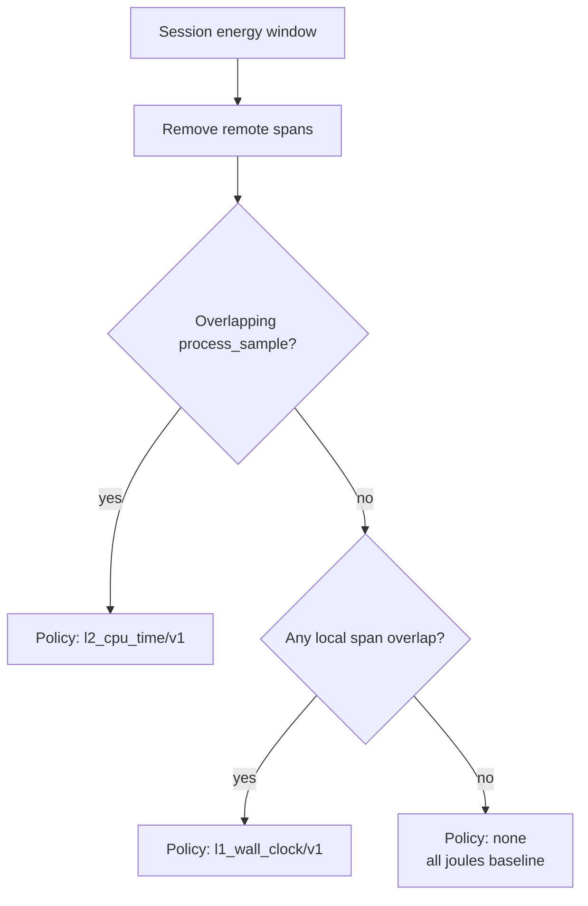

# Energy attribution: machine → session → action span

This document describes the attribution pipeline currently implemented by
`af watch`, the shared CodeCarbon sampler, and `af-core`.

The central invariant is **energy conservation**. A physical machine window is
measured once, divided across active agent sessions once, and then divided
inside each session across action spans. The same host joules must never be
counted once per concurrent session.

## Overview



There are two distinct attribution stages:

1. **Machine → session**, performed by the shared Python sampler.
2. **Session → action span/tool**, performed independently for each session by
   `af-core`.

Keeping these stages separate allows one machine meter to serve concurrent
sessions without losing process-level attribution.

## Stage 1 — measure the machine once

A single CodeCarbon `OfflineEmissionsTracker` runs with
`tracking_mode="machine"`. For each sampling window `[t0, t1)`, it produces
machine energy components such as:

- CPU joules;
- DRAM joules;
- GPU joules when available;
- total machine joules.

At the same time, psutil inspects each active session's watched root process
tree and records:

- root PID;
- CPU-time delta during the window;
- current resident memory;
- orphan metadata when a process outlives its action span.

Only one CodeCarbon tracker exists, regardless of how many coding-agent
sessions are active.

## Stage 2 — split machine energy across sessions

Let:

- `E` be one measured machine energy component in joules;
- `C_s` be the total observed psutil CPU-time delta for session `s` in the
  window;
- `C_total = Σ C_s` across active sessions.

When process CPU was observed:

```text
session_share(s) = C_s / C_total
session_energy(s) = E × session_share(s)
```

The split is applied independently to every measured component. Therefore:

```text
Σ session_energy(s) = E
```

### No observed session CPU

If `C_total == 0`, the current fallback divides the machine window equally
among active sessions:

```text
session_share(s) = 1 / active_session_count
```

This preserves conservation but is a low-confidence fallback. Downstream, a
session slice with no process evidence normally remains baseline/idle unless
wall-clock span overlap permits L1 attribution.

### Session output

For every active session, the sampler writes two events covering the same
window:



The `process_sample` is **not** merged across sessions. Each session keeps its
own PID observations so action/tool attribution remains possible.

## Stage 3 — correlate a session's action spans

Collectors emit `action_span` events describing tool calls. Correlation builds
a `SessionTree` containing:

- the session root PIDs from the bootstrap span;
- action spans and their time ranges;
- explicitly owned PIDs when available;
- execution locus (`local`, `remote`, `hybrid`, or `unknown`).

A span without explicit PIDs inherits the session root PID tree. This is
important for collectors such as the Claude Code hook, which can observe the
agent root PID but cannot always observe a tool's child PID while the tool is
running.

Remote spans are excluded from local energy attribution. Hybrid and unknown
spans currently participate like local spans.

## Stage 4 — attribute a session slice to spans/tools

For every session energy window, `af-core` chooses the best available policy.



### L2 — CPU-time attribution

L2 is used when process observations cover the energy window.

For each PID:

1. duplicate observations are deduplicated by keeping the longest CPU delta;
2. the PID's CPU delta is scaled by overlap between the process window and the
   energy window;
3. all active spans claiming that PID are identified;
4. shared PIDs are split equally between their claimants;
5. orphan-tagged or unclaimed PID CPU is assigned to the orphan bucket.

Let:

- `W_span` be a span's CPU-time weight;
- `W_orphan` be orphan CPU-time weight;
- `W = Σ W_span + W_orphan`;
- `T` be the energy window's wall duration in milliseconds;
- `E_s` be the session's energy slice.

Only the fraction supported by observed CPU activity becomes active energy:

```text
active_energy = E_s × min(1, W / T)
```

Then:

```text
span_energy(span) = active_energy × W_span / W
orphan_energy = active_energy × W_orphan / W
baseline_energy = E_s - Σ span_energy - orphan_energy
```

The denominator uses one core-second per wall-clock second and is capped at
100%. This is intentionally conservative: multi-core CPU activity cannot cause
more energy to be attributed than the measured session slice.

### L1 — wall-clock fallback

When no process sample covers the energy window, attribution falls back to
span/window overlap:

```text
raw_fraction(span) = overlap(span, window) / window_duration
```

Concurrent spans can produce a sum above 1. In that case all fractions are
scaled down proportionally so the energy window is never over-attributed.

```text
span_energy(span) = E_s × normalized_overlap_fraction(span)
baseline_energy = E_s - Σ span_energy
```

### No applicable policy

If no local action span overlaps the window, no attribution policy is claimed.
The complete session energy slice is recorded as baseline/idle.

## Worked example

A five-second machine window measures **100 J**. Two sessions are active:

| Session | Observed CPU delta | Machine share | Session energy |
|---|---:|---:|---:|
| A | 1,000 ms | 25% | 25 J |
| B | 3,000 ms | 75% | 75 J |
| **Total** | **4,000 ms** | **100%** | **100 J** |

Session B contains two overlapping local action spans. After PID claimant
splitting, their CPU weights are:

| Session B bucket | CPU weight |
|---|---:|
| `Bash` span | 2,000 ms |
| `Edit` span | 500 ms |
| orphan process | 500 ms |
| **Total `W`** | **3,000 ms** |

The session window lasts `T = 5,000 ms`, so:

```text
active_energy = 75 J × (3,000 / 5,000) = 45 J
```

The final allocation is:

| Session B bucket | Calculation | Energy |
|---|---|---:|
| `Bash` | `45 × 2,000 / 3,000` | 30 J |
| `Edit` | `45 × 500 / 3,000` | 7.5 J |
| Orphan | `45 × 500 / 3,000` | 7.5 J |
| Baseline/idle | `75 - 45` | 30 J |
| **Total** | | **75 J** |

Across both stages, conservation remains true:

```text
machine energy
= Σ session slices
= Σ span energy + Σ orphan energy + Σ baseline energy
```

## What the result means

The final tool/action figures are **attributed measured machine energy**, not
per-process hardware-meter readings. CodeCarbon supplies the physical machine
observation; psutil supplies relative process activity; correlation supplies
which action spans may claim that activity.

The debug console exposes:

- the policy used for each sample;
- CPU weights and wall-clock overlap;
- per-span allocated joules;
- orphaned joules;
- baseline/idle joules;
- remote spans excluded from local attribution.

This makes every division auditable and prevents missing evidence from being
silently represented as precise process energy.
