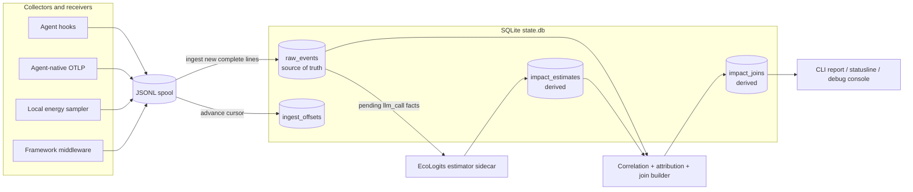
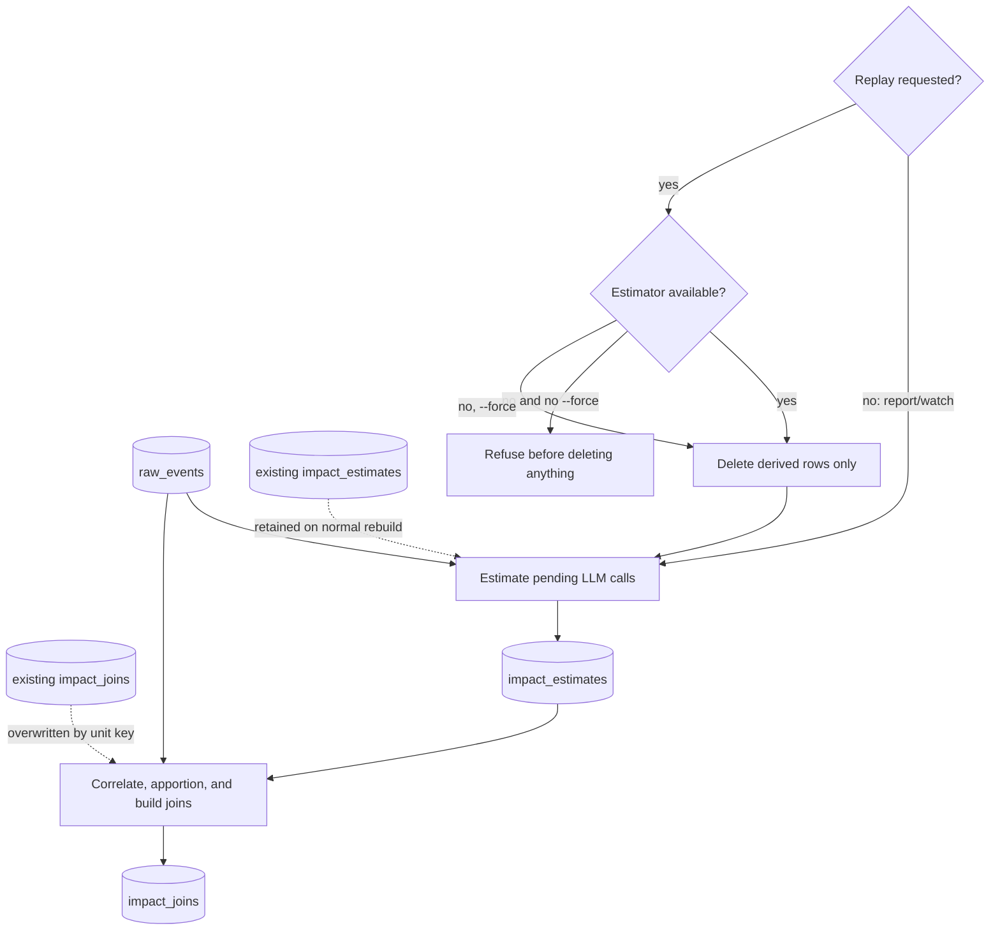
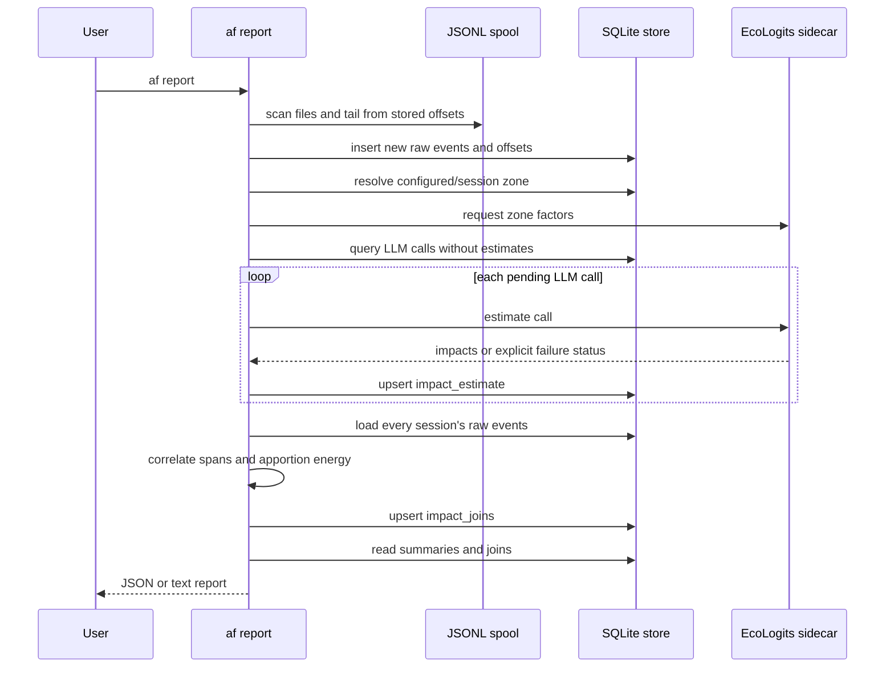
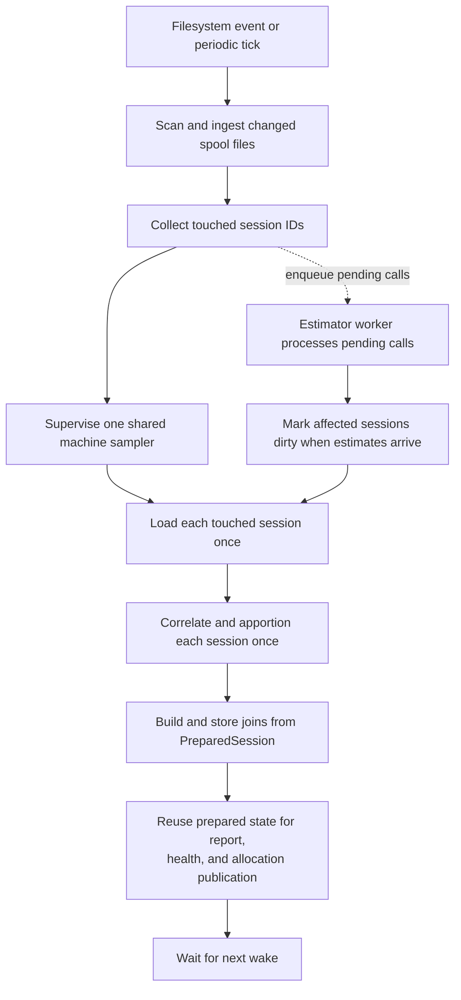

# Rebuild architecture and tracker data flow

This note explains what **rebuild** means in agentic-footprint, how it differs
from ingestion and replay, and how facts move through the tracker.

## The short version

The tracker stores two kinds of data:

1. **Raw facts** are observations emitted by collectors: LLM calls, action
   spans, machine-energy windows, process samples, and session metadata.
2. **Derived views** are the current interpretation of those facts: remote
   impact estimates and joined session/task/tool footprints.

Raw facts are the source of truth. Derived views are disposable caches. A
**rebuild** reads the raw facts and regenerates the derived views under the
current estimation methodology, attribution policy, and electricity zone.

## The three operations people often confuse

### Ingest

Ingestion moves newly appended, complete JSONL lines from the spool into
`raw_events`. Per-file byte positions are stored in `ingest_offsets`, so the
next pass should only consume appended bytes.

Ingest does **not** calculate environmental impact.

### Rebuild derived views

`rebuild_derived` is the calculation pipeline. It:

1. obtains electricity-mix factors when an estimator is available;
2. estimates any `llm_call` that has no stored estimate yet;
3. loads every session's raw events;
4. correlates action spans into a session tree;
5. apportions local energy samples to those spans;
6. combines local measurements and remote estimates;
7. upserts session/task/tool records into `impact_joins`.

Despite its name, a normal rebuild does **not** delete raw events, reread the
whole spool, or normally delete existing estimates. It recomputes the joined
view, while only estimating the remote calls still missing an estimate.

### Replay

`af replay` is a destructive rebuild of **derived data only**. It first clears
`impact_estimates` and `impact_joins`, then runs the same calculation pipeline
from the retained `raw_events`.

Replay exists so a methodology or attribution-policy update can be applied to
history without recollecting the original observations.

## What `af report` does

`af report` is not read-only. It performs an on-demand update before printing:

The important consequence is that report latency scales with the outstanding
estimation backlog and with all retained sessions that are rebuilt.

## What `af watch` does today

The resident tracker runs a debounced pass when the spool changes, with a
periodic tick as a fallback.

The resident path is deliberately scoped and non-blocking:

- only sessions changed by ingestion, sampling, or completed estimates are
  rebuilt;
- each touched session's event history is loaded once per pass;
- correlation and energy apportionment are computed once into a prepared
  session and reused for join storage and debug publication;
- remote estimation runs in a worker, so slow model-impact estimation does not
  block new spool ingestion;
- completed estimates schedule another rebuild only for the affected sessions.

`af report` and `af replay` still use the complete-store pipeline because they
must present or regenerate a coherent view of retained history. The optimized
watch path changes scheduling and reuse, not the raw/derived contracts or the
attribution result.

## Why keep raw and derived data separate?

### Methodology upgrades

An EcoLogits version, model dataset, electricity factor, or attribution policy
can change. Keeping raw observations allows the project to recalculate history
instead of permanently freezing the first answer it produced.

### Honest degradation

Local measurement does not depend on the remote-impact estimator. If Python or
EcoLogits is unavailable, joins can still report local energy while remote
calls remain explicitly `pending`.

### Auditability

A derived footprint can be traced back to the exact raw calls, spans, process
samples, and energy windows that produced it.

### Multiple presentation layers

The statusline, CLI report, debug console, and a future remote exporter can all
read the same stored derived view instead of implementing environmental
methodology independently.

## What is truly rebuildable?

| Data | Deleted by normal report/watch? | Deleted by replay? | Reconstructable from raw facts alone? |
|---|---:|---:|---:|
| JSONL spool | No | No | Original collector transport |
| `raw_events` | No | No | Source of truth |
| `ingest_offsets` | No | No | Operational cursor, not an impact result |
| `impact_joins` | Overwritten by key | Yes | Yes |
| `impact_estimates` | Existing rows retained; missing rows added | Yes | Only with the estimator and its methodology/data available |

The final row explains the replay safety check: deleting estimates without a
working estimator would remove information the Rust core cannot regenerate by
itself. Replay therefore refuses before deletion unless `--force` is explicit.

## A useful mental model

Think of the system as a small event-sourced application:

- the spool is the transport log;
- `raw_events` is the durable fact ledger;
- `impact_estimates` is a methodology-dependent enrichment cache;
- `impact_joins` is a materialized read model;
- rebuild is materialized-view refresh;
- replay is dropping and regenerating the methodology-dependent views.

That model also suggests the main performance direction: preserve the immutable
fact ledger, but track which sessions and derived units are dirty so ordinary
watch passes refresh only affected materialized views.
